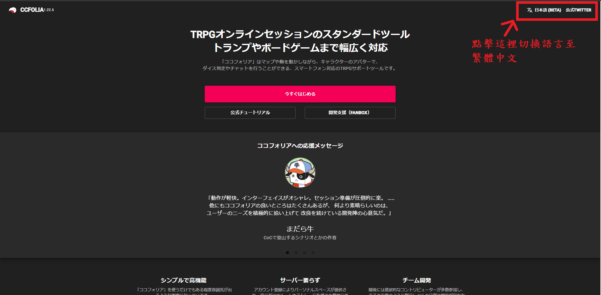
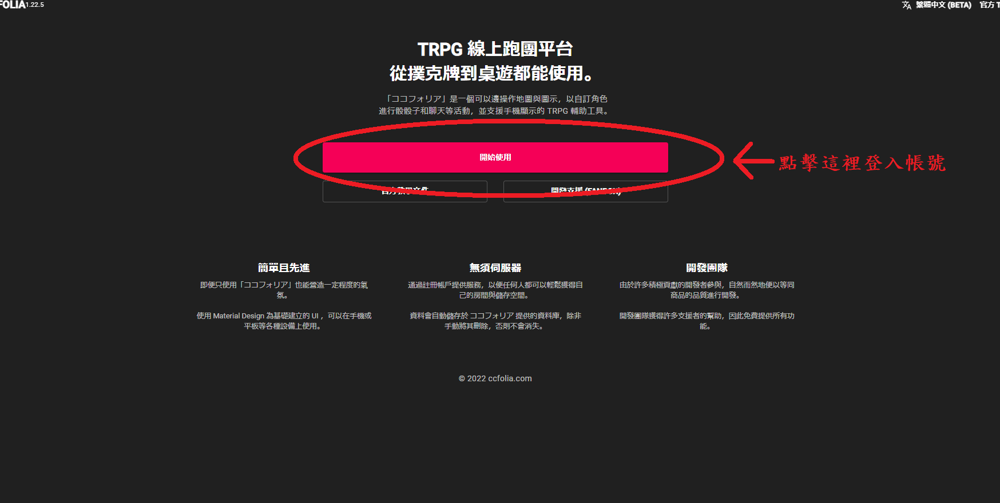
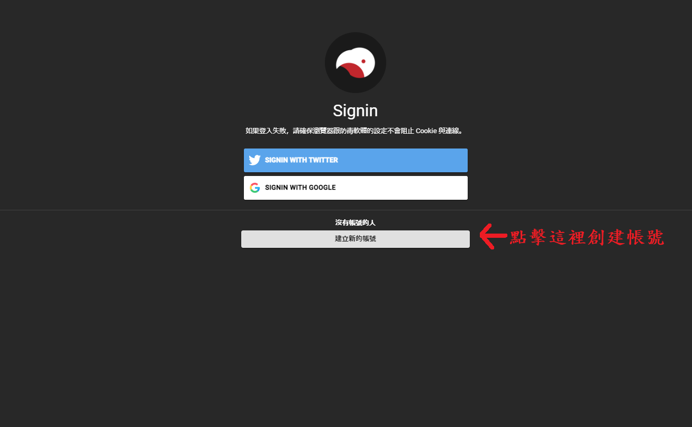
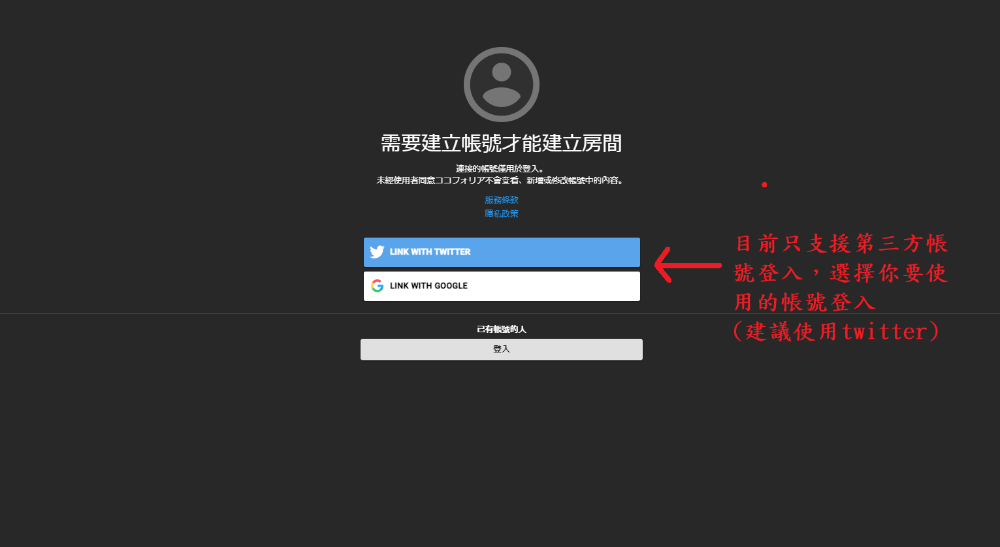

# CCFolia V1.0 創角教學文件

## 1. 前往CCFolia的首頁進行語系切換
CCFolia首頁 -> [https://ccfolia.com/](https://ccfolia.com/)

點擊右上角切換語系

## 2. 註冊帳號

點擊「開始使用」

點擊「建立新的帳號」進行註冊

因為只支持第三方登入，因此選擇使用Google或Twitter登入

## 3. 「維持登入的狀態下」進入主持人提供的房間網址，方可進行角色創建
1. 角色創建教學影片  
[https://youtu.be/1xFlWAStcEg](https://youtu.be/1xFlWAStcEg)

2. 快速匯入角色卡教學影片  
[https://youtu.be/g4q38Nz942Y](https://youtu.be/g4q38Nz942Y)
