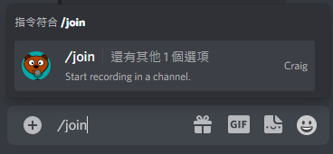
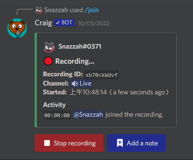
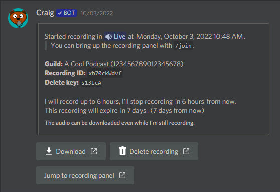
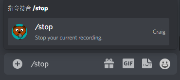
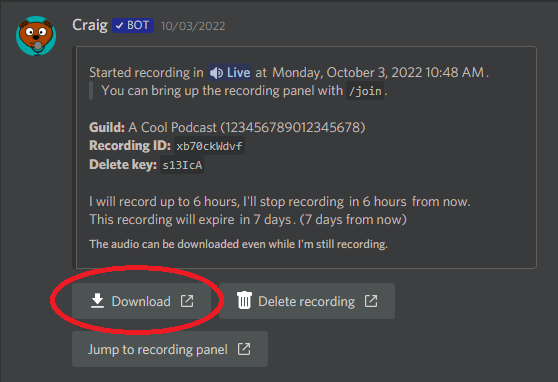

# 錄音機器人Craig使用說明
1. 進入語音頻道之後，再進行機器人呼叫，呼叫方式，任意文字頻道輸入```/join```。Craig就會進入你現在身處的語音頻道中。  

2. 出現以下提示訊息就表示成功錄音

3. 同時可以發現Craig會私訊你一段訊息，這是下載音檔的網址

4. 結束錄音在任意文字頻道輸入```/stop```。

5. 下載音檔方式，點擊Craig私訊中的```Download```

6. 下載音檔的網站長這樣
  
   - ```Multi-track```是指多軌音檔，會把所有人的語音分成個別的音檔，在製作影片之類的很常使用  
   - ```Single-track mixed``` 是指單軌音檔，是將所有人的語音合成一個檔案，單純紀錄的話下載這個版本就好
   - 下方可下載的選項分別說明
      - ```Audacity Project```是指將音檔下載成一個音訊剪輯軟體的專案，是一個叫[Audacity](https://www.audacityteam.org/)的軟體
      - ```FLAC```是指將錄音檔下載成FLAC檔，一種無損壓縮音檔，檔案大小偏大。
      - ```wav```是指將錄音檔下載成WAVE檔，一種無損音檔，檔案大小非常大。
      - ``` AAC (MPEG-4)```將檔案下載成壓縮MPEG-4編碼檔，一種失真壓縮音檔，類似於mp3，檔案大小也跟mp3差不多，純紀錄的話下載這檔案即可
      > **Warning**  
      > 若按鈕呈現紅色，就代表會大量使用到瀏覽器中的Ennuizel的功能，會根據不同的瀏覽器而占用到大量的RAM，若有其他問題，請選擇非紅色按鈕。
   
7. 若點擊紅色的按鈕，會出現以下的提示訊息，按下```I understand.```即可。

8. 開始下載的畫面，多軌與單軌下載的畫面不同，要注意
- 多軌``` AAC (MPEG-4)```

- 單軌``` AAC (MPEG-4)```
