# 關於Dungeondraft
  
是由Megasploot開發的一款地圖繪製軟體。
主要的功能自然是用於繪製像DND跑團中會在Roll20或FVTT這種平台上跑團時，使用到的平面方格式地圖。

> 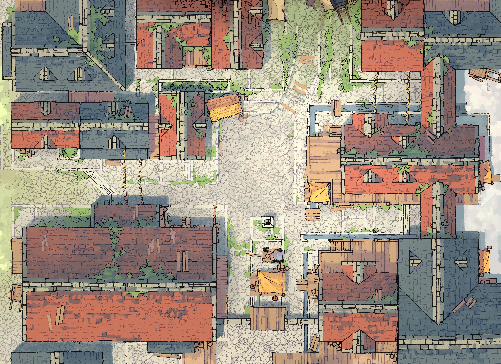
> 由2-Minute Tabletop繪製的Town Center

## 此軟體具備以下特點
- 好用的使用者UI
- 乾淨且吸引人的藝術風格(以系統預設的美術素材來說)
- 工具的使用上十分直觀且容易上手，過程也不會繁瑣
- 在拼貼素材上有軟體的輔助，呈現效果更加漂亮
- 利用系統提供的工具甚至能畫出美麗的風影畫
- 內建光影系統
- 有自動生成地下城或洞穴地圖的功能
- 不需要連上網路即可使用，也沒有DRM
- 不需要額外的商業許可即可進行商業行為
- 也有非常簡單的輸出功能，可輸出不同的檔案格式

而且更重要的，是**買斷制！！！**  
只需要19.99美元即可終生使用此軟體，甚至依靠其他第三方的素材也能繪製出超級漂亮的地圖。  
如此划算的軟體還可以不用它嗎？沒有！  
所以趕緊來下單購買吧！  
[Dungeondraft](https://dungeondraft.net/)  

此軟體也有由網路上的其他人製作的教學文章，一些紀錄在了Dungeondraft的Github的Wiki中：[Dungeondraft Wiki](https://github.com/Megasploot/Dungeondraft/wiki)  
其中就有由EightBitz撰寫的教學文件(0.9.2.0版本)：[Community Manual](https://www.dropbox.com/sh/bqygibkze47vi65/AAAnJvMEWaDxPFkxS_H2Mkp7a/v0.9.2.0%20Toxic%20Pangolin/Dungeondraft%20v0.9.2.0%20toxic%20pangolin%20%28The%20Unofficial%20Manual%29.docx?dl=0)  
而這幾篇文章則會以這篇教學文件文主將內容翻譯成中文後重新潤色，並參照了現在的版本(1.0.4.7版本)做修改  

## 開始使用Dungeondraft最重要的五件事
首先要購買後安裝，不，這不是廢話嗎。  
這邊是講說要開始使用前，可以先進行的設定，有些是方便的功能，有些是讓這軟體有更多擴充的方法，無論如何，都讓我們來看看是哪五件事情吧。  

### 1. 設定自動備份
首先開啟Dungeondraft時會發現上方一排的工具列  
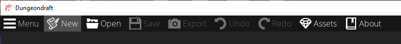  
點擊左上角的"Menu"按鈕，並點擊其中的"Preferences"  
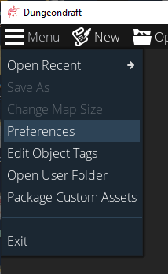  
這裡要注意的是自動備份(Automatic Backups)的設置，在默認的情況下，會每10分鐘備份一次，並且最多保留50個備份。  
當這數量超過限制，將會自動刪除最舊的備份以騰出空間。  
通常自動備份的這定不用特別去調整，直接使用預設值即可  
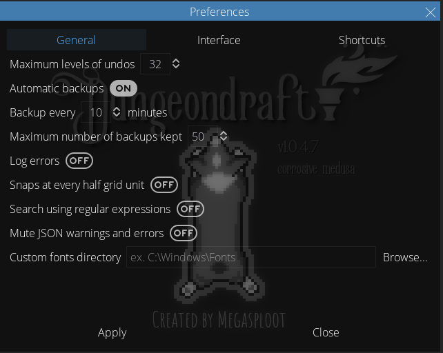  
因此，我們只需要按下"Close"，讓這些參數持預設值即可  

### 2. 自動備份儲存的位置
點擊左"Menu"，並點擊其中的"Open User Folder"  
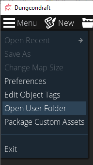  

這是打開Dungeondraft用戶資料夾最快的方式，你也可以瀏覽以下位置到用戶資料夾  
```
%appdata%\Dungeondraft
```
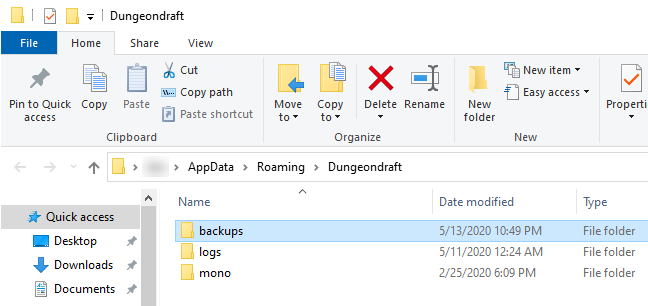  

要注意的是，在這資料夾中的一個名叫```backups```的資料夾是自動備份時儲存的資料夾  
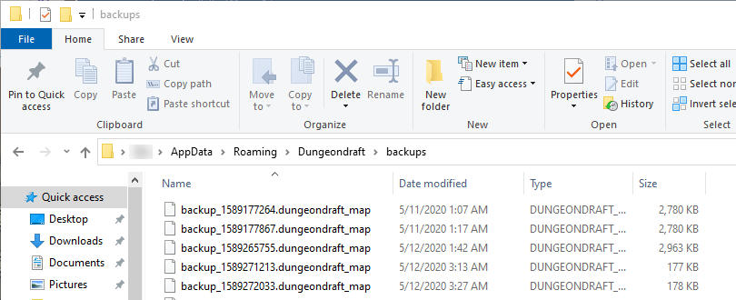  

如果你在繪製地圖的過程中發生了程式崩潰，就可以在這裡找到之前的備份，並透過加載最新的備份來恢復你之前的工作進度。  
當你打開備份檔案的地圖後，務必確保不要將此地圖重新儲存回備份資料夾中了。點擊「另存新檔(Save As option)」(在"Menu"下拉選單中)將此地圖儲存到其他資料夾中。  

> **Note**
> 雖然自動備份在緊急狀況下是個很重要的功能，他能確保你的資料不因為意外而損毀。但這裡依舊不建議過度去依賴此功能。  
> 建議還是養成時常儲存檔案的習慣，並為不同版本的地圖儲存不同的檔案。  
> 此自動備份是個不錯的功能，但不到緊急情會最好不要用到它。  

## 3. 設定第三方素材(Assets)的位置
Dungeondraft有允許玩家匯入第三方素材的功能。可能剛使用Dungeondraft時不太會用到這功能，但還是建議給他先設定一個位置。  
這個位置可以設定在任何你經常儲存的位置。不過這裡建議是建立在"文件"資料夾中，在這創建一個新資料夾，並命名為“Dungeondraft_packs”，這資料夾也會是此偏的範例位置。  
如果你選擇在不同的位置底下建立這個資料夾，請在執行相關行動時適當的修改你的儲存位置。  

檢視上方個工作列，並點擊"Assets"選項  
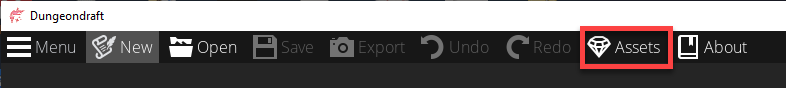  

他將會開啟一個名為"Custom Assets"的視窗，點擊右邊的"Browse"  
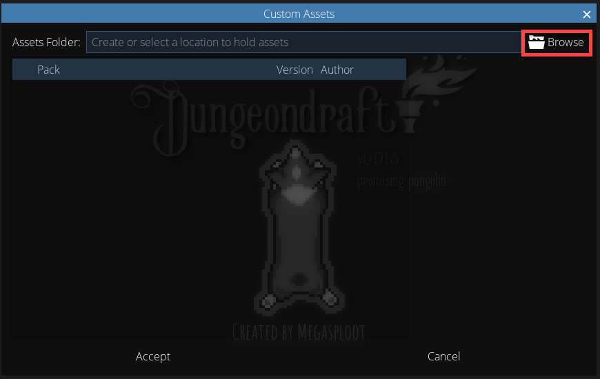  

將會開啟選擇資料夾的視窗，瀏覽你要選擇的儲存第三方位置的資料夾。不用將資料夾開啟，只需要點擊它並出現點擊提示即可，隨後點擊"選擇資料夾"  
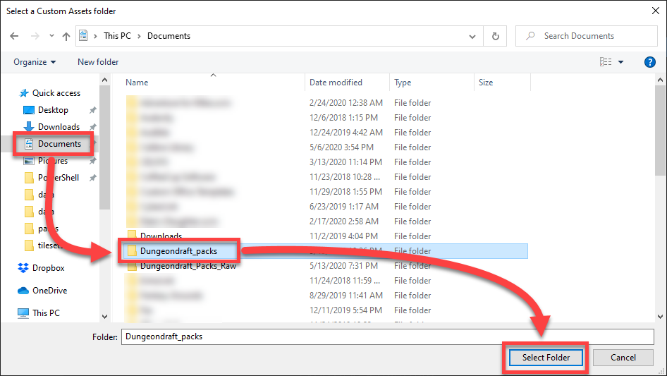  

確認它上面顯示的是正確的資料夾位置，便可點擊下方的"Accept"  
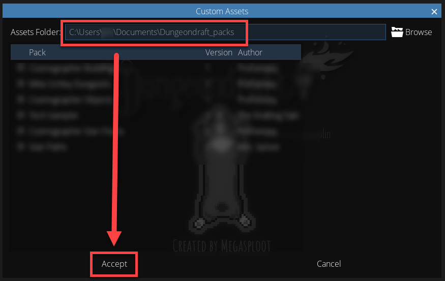  


## 4. 版本的更新
當你第一次打開Dungeondraft時，在視窗的邊框附近，你可以看到你當前的版本訊息，在視窗的右上角，你可以看到你是否是最新的版本，或者是否有可用的更新。  
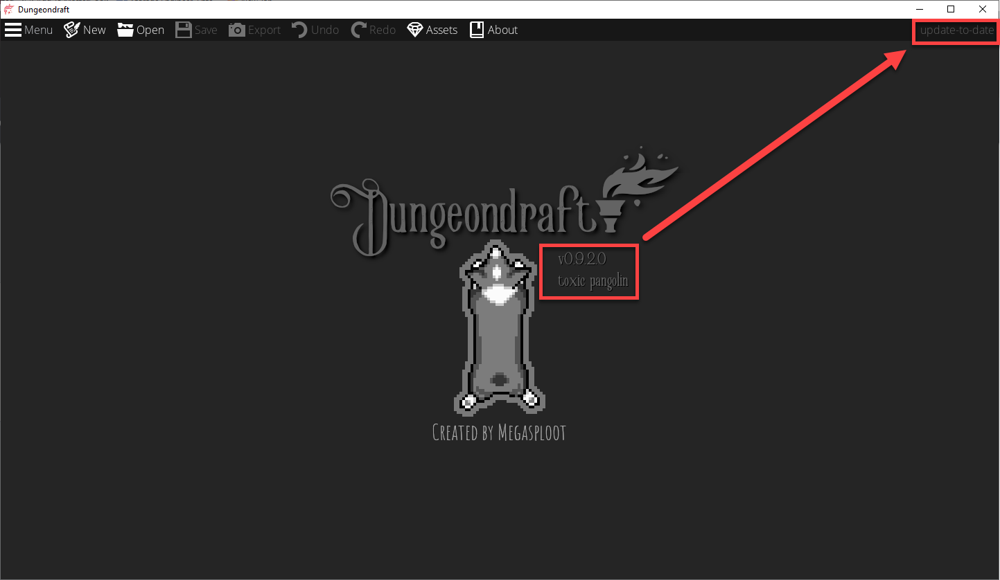  

如果有可用的更新，你可以登入你的Humble Bundle帳號，並下載最新的安裝程式，用以進行安裝更新。不必解除安裝再重新安裝，只需要安裝最新版本即可。  

## 5. 滑鼠與鍵盤的快捷鍵
### 基礎功能
|動作|快捷鍵|
|  ----  | ----  |
|視野平移|移動滑鼠時按住滑鼠中鍵或空白鍵|
|視野縮放|CTRL+滑鼠滾輪|
|刪除物件|DELETE 或 BACKSPACE|
|退出|ESC|
|選擇工具|X|
|復原|CTRL + Z|
|取消復原|CTRL + Y|
|畫筆尺寸增大|右括號(|
|畫筆尺寸減小|左括號)|
|地圖網格開啟與關閉(grid)|G|
|對齊網格功能開啟予關閉(snap)|S|
|視野上移|PgUp|
|視野下移|PgDn|

### 地板形狀工具(Floor Shape Tool)、洞穴筆刷(Cave Brush)、水筆刷(Water Brush)、材質筆刷(Material Brush)
|動作|快捷鍵|
|  ----  | ----  |
|擦除地板、材料、地形或水|使用適當的工具/筆刷繪圖同時按住ALT鍵|

### 地板形狀(Floor Shape)、牆壁工具(Wall Tool) - 多邊形、路徑式繪製快捷鍵
|動作|快捷鍵|
|  ----  | ----  |
|曲線|設置第一個點之後按住SHIFT|

### 對物體進行設置(Object Tool)
|動作|快捷鍵|
|  ----  | ----  |
|旋轉|滑鼠滾輪|
|慢速旋轉|Z+滑鼠滾輪|
|縮放|ALT+滑鼠滾輪|
|替換成下一個物件|SHIFT+滑鼠滾輪|
|鏡像物件|按住A|

以上的東西均設置完，並了解完畢，那就可以開始正式使用Dungeondraft啦！