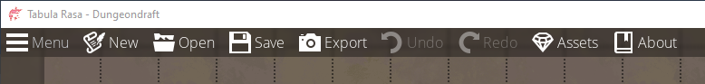

# 頂部選單列
這是關於頂部選單的簡略概述。如果需要詳細了解裡面的所有功能，將會在後續的內容作詳細的說明。  
  
   1. ```Menu```選項是唯一有下拉式選單的選項
      a. ```Open Recent```將會顯示一些你之前編輯過的地圖，以便你快速選擇你將要進行編輯的地圖。
      b. ```Save as```會打開選擇資料夾視窗，讓你將當前的地圖保存到你指定的資料夾中，並命名該文件的名稱。
      c. ```Change Map Size```更改地圖的尺寸
      d. ```Perferences```將會打開一個視窗，能夠設置各種選項
         - ```General```中的選項
         i. ```Maximum levels of undos```設定「還原」次數上限(預設值為32)
         ii. “Automatic backups”自動備份功能開啟羽關閉(預設值為ON)
         iii. ```Backup every __ minutes```設定多少時間後進行一次備份(預設值為10分鐘一次)
         iv. ```Maximum number of backups kept```備份檔案最大保留份數(預設值為50份)
         v. ```Log errors```記錄錯誤訊息選項(預設值為OFF)
         vi. ```Snaps at every half grid unit```物件以每半個網格為單位自動對齊其他物件選項(預設值為OFF)
         vii. ```Search using regular expressions```搜尋時是否能使用正則表達式(預設值為OFF)
         viii. ```Mute JSON warnings and errors```在處理JSON文件時是否會顯示警告和錯誤訊息(預設值為OFF)
         IX. ```Custom fonts directory```設定自訂義字體位置
         - ```inferface```中的選項
         i. "Enlarge UI"使用者介面放大(預設值為OFF)
         ii. "Load full preview after hovering _ seconds"設定滑鼠停在物件上後過了多久後會顯示預覽圖(預設值為0.2秒)
         - ```Shortcuts``` 中的選項
         若想修改快捷鍵，則可以在這裡修改
   2. ```New```將會創建一張新地圖
   3. ```Open```將會載入先前儲存的地圖
   4. ```Save```將儲存你的地圖。如果你尚未儲存地圖，系統會提式你指定的資料夾位置和資料名稱。否則，這會預設你希望覆蓋之前儲存的版本。
   5. ```Export```將地圖以圖像檔導出，可用於列印或展示。或者導出成"Universal VTT"的文件，然後將其匯入支援"Universal VTT"文件的VTT程式
   6. ```Undo```和```Redo```這應該很好理解，就是「復原」跟「重作」。他們的快捷鍵是(CTRL + Z和CTRL + Y)
   7. ```Assets```用於設置第三方素材的位置
   8. ```About```顯示版本訊息和版權聲明

