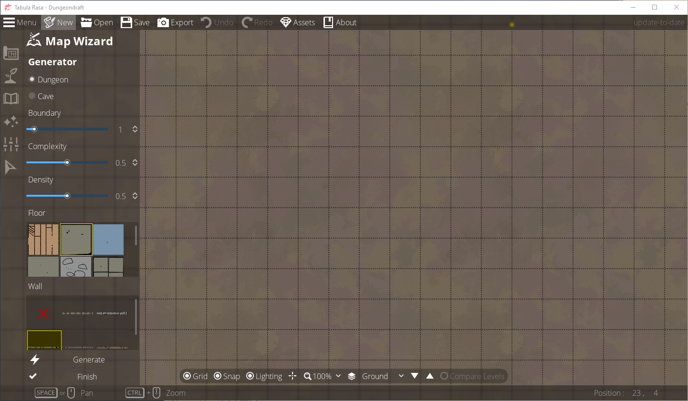

# 創建一張新地圖
Dungeondraft中有提中```Map Wizard```的功能，這是能夠建立心地團最快速和最簡單的方法。Map Wizard將會根據你的選擇，創建隨機的地牢或洞穴系統。  
創建空白地圖將給你一個空白的葉面，讓你可以畫出你想要的東西。  
使用Map Wizard依舊可以使用創建空白地圖時相同的工具和選項。它只是給你一個起點，讓你可以在此基礎上開始，並根據喜好進行編輯。  
無論哪種方式，最一開始都是先點擊上方的菜單來中的```New```。  
  

當你點擊```New```之後，便會顯示創建地圖的選項視窗，裡面能夠讓你調整地圖上方格的形式與設置地圖的高度與寬度。(目前尚不知元六角型網格，說不定之後會支援)。  
請注意你要由玩的遊戲中，規範的網格方格可能都有所不同。比如說，在某些系統中，每個網格代表5平方英尺，而在某些系統中，每個網格代表10平方英尺。  
  

在"Template"下拉是選單中可以選擇如何使用地圖，以便展示或列印，每個方格都會是一平方英尺。這能夠讓你在一場遊戲中當作是戰鬥的地圖。  
  

單前可用的模板及各自選項代表的地圖大小
|選項|大小|
|------|-------|
|40" TV|35格 X 20格|
|55" TV|48格 x 27格|
|A4 Paper|11格 x 8格|
|A3 Paper|16格 x 11格|

如果你對現有的模板不滿意，也可以自己設寬度與高度。只需點擊數字並將他們更改成想要的數字即可。你可以設置最大尺寸128格x128格。  
請記住，地圖越大，對處理器速度、記憶體、顯示卡就產生越大的資源需求。將地圖保持在合理的尺寸範圍內，可以提高性能並提高穩定性。  
就本文檔的目的而言，將會選擇40"。  
  

## 使用Map Wizard開始創建地圖
設定好地圖大小後，開啟"Start with Map Wizard"，然後選擇"OK"  
   

你應該可以看到視窗會這樣顯示：  
   

案住```CTRL```後滾動滑鼠滾輪，可以縮小地圖，使其看見完整大小。  
  

在左上角靠近頂部的位置，有兩個選項"Dungeon"或"Cave"，默認的情況下是選擇"Dungeon"。  
  

在此之下，還可以調整"Boundary(邊界)"、"Complexity(複雜度)"和"Density(密度)"三個參數  
  

在此之下，你可以選擇所需的"地板"與"牆壁"材質，記住每個選項都有可向下滾動的選單，可以選擇更多的材質。  
  

隨後為了能夠在畫布生成我們需要的地圖，點擊下方的"Generate"，看看會發生甚麼事情  
  

這只是一個範例。由於它是隨機生成的，因此你會看到不同的布局。如果你對生成的內容感到滿意，可以點擊"Finish"。如果尚未滿意，你可以再次點擊"Generate"，將可以獲得不一樣的布局。  

現在，將選項從"Dungeon"更改為"Cave"，然後再次點擊"Generate"。  
  

同樣的，這只是一個範例。由於它是隨機生成的，因此你會看到不同的布局。如果你對生成的內容感到滿意，可以點擊"Finish"。如果尚未滿意，你可以再次點擊"Generate"，將可以獲得不一樣的布局。  

也可以隨意嘗試“Boundary”、“Complexity”和“Density”三個參數會對隨機生成產生什麼樣的改變，以了解他們的作用。對於"Cave"，你只能使用預設的地板和牆壁，但對於"Dungeon"，你可以對每個地方分別進行實驗。  
一旦單擊 "Finish"，您就會進入主地圖編輯器，在那裡您有與建立空白地圖相同的工具、功能和選項。  
  

雖然看似沒有很多要注意的地方，但左側的工具列可以提供更多功能。  

## 創建空白地圖
設置新地圖的大小後，取消"Start with Map Wizard"的功能，然後點擊"OK"。  
  

您將直接進入空白的主地圖編輯器。  
  
