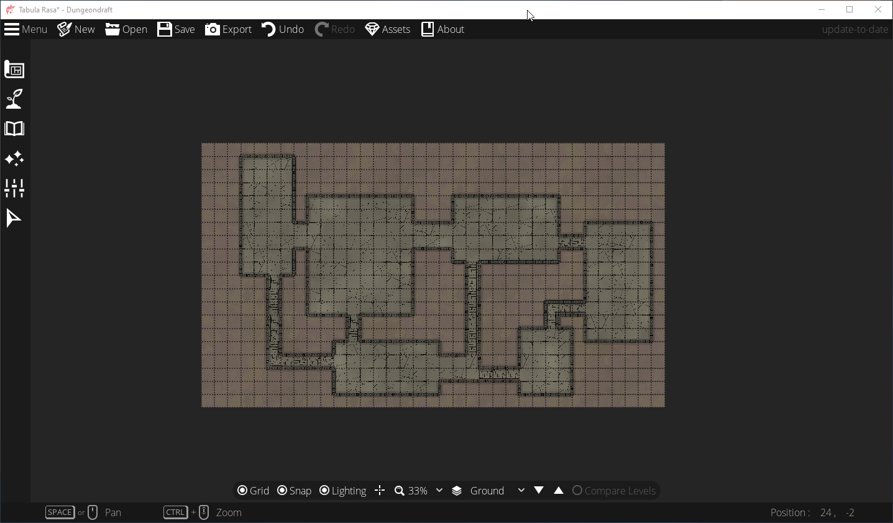
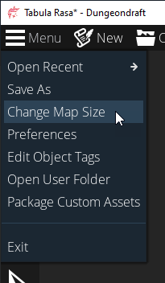
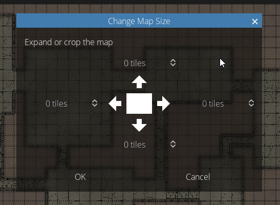
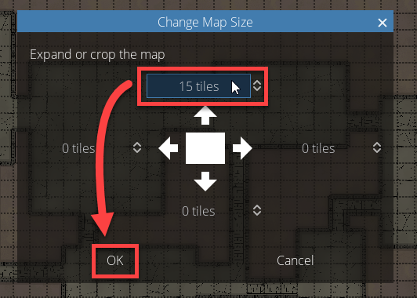
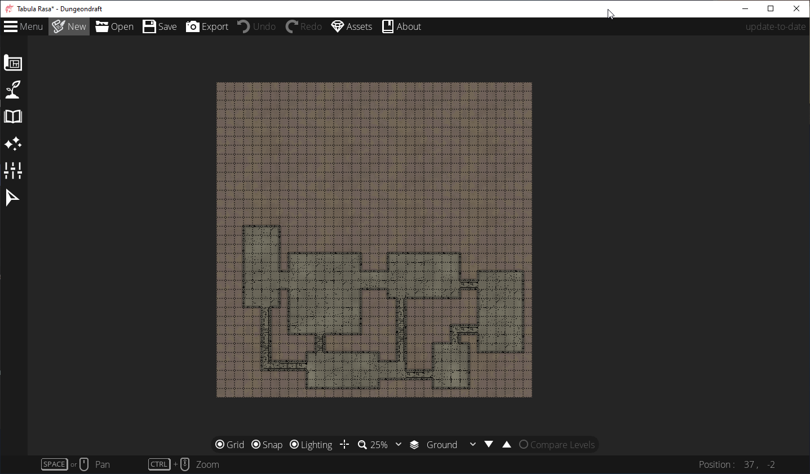
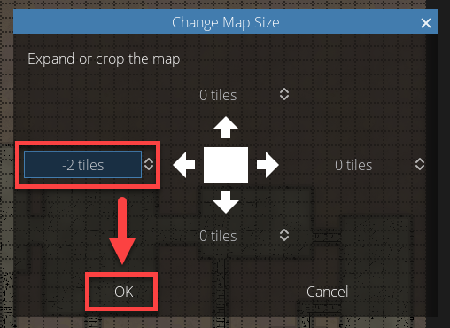
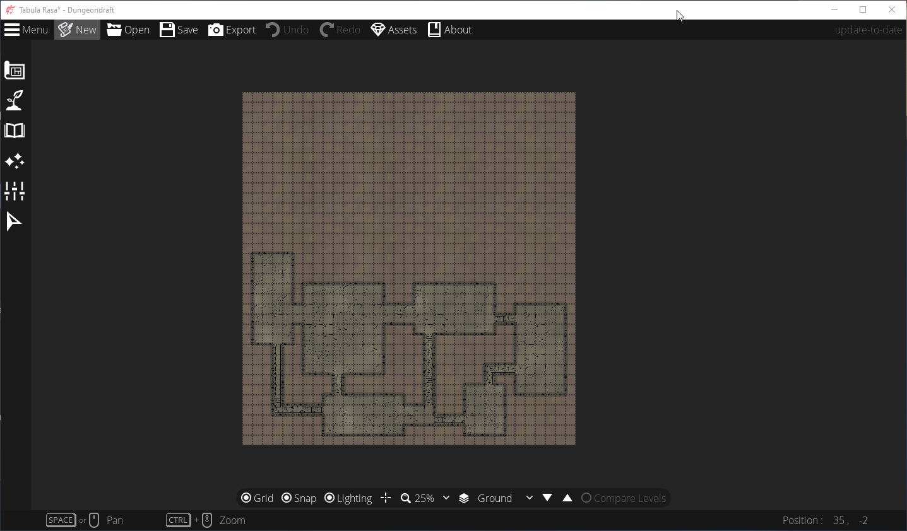

# 修改地圖尺寸
如果你正在編輯地圖時，你意識到需要更多空間來做你想做的事情時，你就可以使用"Change Map Size"的功能。  
為了說明，我用map wizard功能創建了一個地下城。我使用了40" TV的模板，所以它寬35格'，高20格。我還縮小了整個地圖的可見度，能夠看到完整的地圖。  
    

假設我現在想在頂部添加一塊方形的空間，使這地圖變成高35格，寬35格。  

1. 點擊上方"Menu"下拉是選單，然後選擇"Change Map Size"  
   

2. 將會顯示一個"Change Map Size"的對話框，中間有一個白色方塊代表我的地圖，在方塊的每個邊側，將會看到一個"0 tiles"  
   

3. 目前地圖是35x20的大小，如果想要修改成35x35的正方形，就需要再往頂部或底部添加15格的網格。以此為例，我將會在頂部添加15格，因此在上方的方格中輸入"15 tiles"，隨後點擊"OK"。  
   

4. 現在我就擁有了一張35格寬 x 35格高的地圖  
   

現在，我決定不想要左邊多餘的空間，所以想要刪除它。  
我希望我的地下城左邊的牆壁距離地圖邊界只有一格，而不是三格。  

1. 再度點擊"Menu"，然後點擊"Change Map Size"  

2. 在左邊的方格中，將其從0修改成-2(負2) tiles，然後點擊"OK"。  
   

3. 現在我就擁有了一張33格寬 x 35格高的地圖  
   
